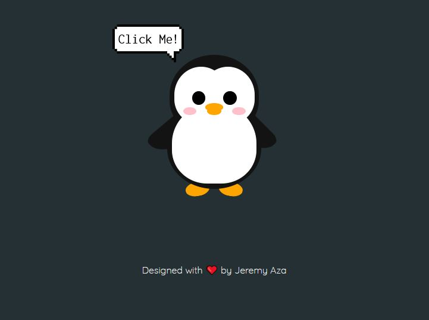

# Penguin
Learn to do a penguin with HTML, SASS and JavaScript

# Details
This project is a basic example about JavaScript functions and keyframes animations.

## Live Application URL ✨
The Application is deployed in https://penguin-hello.web.app/
Click on the link to see the application

## Cloning 🔮
Clone the project into local and enjoy!
